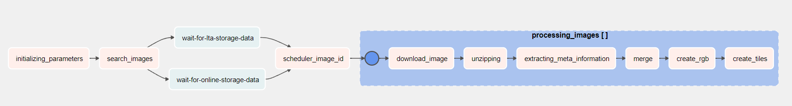

# Описание
Данный репозиторий содержит модуль для скачивания снимков ДЗЗ с https://scihub.copernicus.eu с последующим препроцессингом и преобразования в tiles.
Модуль спроектирован на базе планировщика задач Aiflow. На данный момент поддерживается автоматическое скачивание и обработка снимков Sentinel

DAG:


# Запуск
Перед запуском контейнера airflow необходимо экспортировать переменные окружения из корневого каталога: 
* Linux:
 ```
export LOCAL_DATA_DIR=$(pwd)/data
export PASSWORD=YOUR_PASSWORD
export FERNET_KEY=$(python3 -c "from cryptography.fernet import Fernet; FERNET_KEY = Fernet.generate_key().decode(); print(FERNET_KEY)")
 ```
* Windows
 ```
$env:PASSWORD=YOUR_PASSWORD
$env:LOCAL_DATA_DIR="$(pwd)/data"
$env:AIRFLOW_PROJ_DIR="$(pwd)" // Определиться с монтированием папки data
$env:FERNET_KEY="$(python -c "from cryptography.fernet import Fernet; FERNET_KEY = Fernet.generate_key().decode(); print(FERNET_KEY)")"
 ```

Далее необходимо указать переменные окружения в файле `.env.example`:
```commandline
AIRFLOW_UID=50000
USER_COPERNICUS_LOGIN --- Логин для авторизации на сайте https://scihub.copernicus.eu
USER_COPERNICUS_PASSWORD --- Пароль для авторизации на сайте https://scihub.copernicus.eu
```
Далее необходимо переименовать `.env.example` -> `.env` или же просто изменить название файла в команде ниже


Для запуска контейнера необходимо выполнить следующую команду:
```commandline
docker-compose --env-file .env up  --build 
```

Для очистки контейнеров и volumes необходимо использовать следующую команду:
```commandline
docker-compose down --volumes 
```

Данные для авторизации на Airflow по умолчанию:
```commandline
login: airflow
password: airflow
```

# Улучшения:
- [ ] Синхронизация Dags c GitHub
- [ ] Добавить возможность качать с нескольких аккаунтов
- [ ] Добавить поддержку скачивания снимков с LTA
- [ ] Настроить удаленный запуск Dags
- [ ] Настроить Dag по закачке снимков с параметрами
- [ ] Добавить скрипт для выкачки снимков с API Sentinel